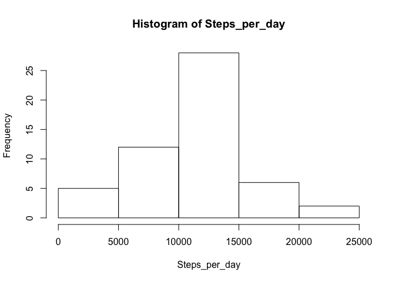
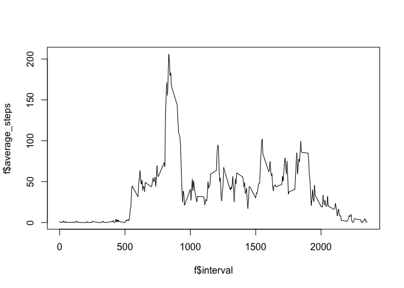
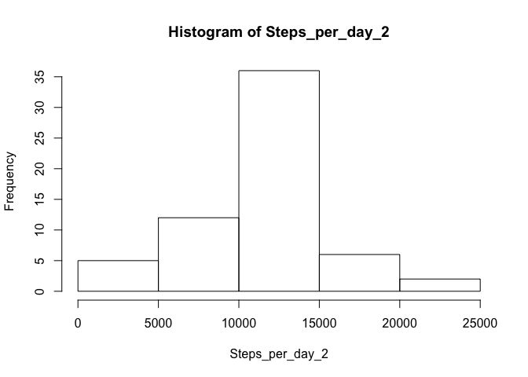
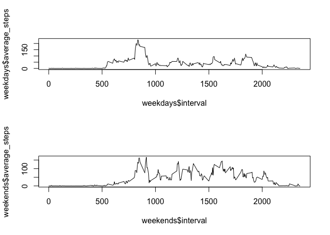

# Reproducible Research, Project 1
Olivier B. Simon  
April 10, 2016  

1. First, here is the code for reading in the dataset (on my computer), and make sure the global options are set to echo=TRUE.

```r
a <- read.csv("activity.csv", stringsAsFactors=FALSE)
```

2. Now we want to take the mean number of steps per day. I apply group_by to the date column... then sum the steps per day, then take the mean. 

```r
library(dplyr)
```

```
## 
## Attaching package: 'dplyr'
## 
## The following object is masked from 'package:stats':
## 
##     filter
## 
## The following objects are masked from 'package:base':
## 
##     intersect, setdiff, setequal, union
```

```r
b <- a %>%
       group_by(date) %>%
       dplyr::summarise(steps_taken = sum(steps))
```

Now we have to change the summary back into a data frame before we can do a histogram.

```r
c <- as.data.frame(b)
Steps_per_day <- as.numeric(c$steps)
hist(Steps_per_day)
```

 

To get the mean and median of steps per day, remove the NAs:

```r
Steps_per_day <- Steps_per_day[!is.na(Steps_per_day)]
mean(Steps_per_day)
```

```
## [1] 10766.19
```

```r
median(Steps_per_day)
```

```
## [1] 10765
```

3. Now we want to make a time series plot of each time interval, averaged over all the days, to give a sort of "stereotypical day". This should be the same idea as above, but use group_by in a different order. Gotta leave out the NAs for mean() to work.

```r
e <- a %>%
       group_by(interval) %>%
       dplyr::summarise(average_steps = mean(steps, na.rm=TRUE))
f <- as.data.frame(e)
```

Now for the time series plot:

```r
plot(f$interval, f$average_steps, type="l")
```

 

And the interval with the maximum average value is:

```r
f[which.max(f[,2]), 1]
```

```
## [1] 835
```

4. To calculate and report the number of time intervals with NAs in them:

```r
NAcount <- length(a[,1][is.na(a[,1])])
```

Next we want to fill in all the NAs with the average value for their particular interval. The test period is 61 days, so create 61 copies of the averages list, one for each day:

```r
g <- rep(f[,2], 61)
```

Now we fill in only the values which are NA, using the corresponding entries in g:

```r
h <- a[,1]
h[which(is.na(a[,1]))] <- g[which(is.na(a[,1]))]
```

h is now the new "steps" column. We create a new copy i of the dataset a, and replace its first row with h:

```r
i <- a
i[,1] <- h
```

Dataset i now has all the NAs from the original, a, filled in with the average value for the given interval.

Finally, to see what the effect is when we fill in NAs with the mean, we are supposed to create a new histogram and re-calculate the mean and median steps taken per day. This is the same as above, but the remove NA step won't be necessary: 

```r
j <- i %>%
       group_by(date) %>%
       dplyr::summarise(steps_taken = sum(steps))

k <- as.data.frame(j)
Steps_per_day_2 <- as.numeric(k$steps)

hist(Steps_per_day_2)
```

 

```r
mean(Steps_per_day_2)
```

```
## [1] 10766.19
```

```r
median(Steps_per_day_2)
```

```
## [1] 10766.19
```

It seems that filling in the NAs with the average of the rest does not change the mean value. The median is slightly increased. The histogram changes in that the central bar gets higher in frequency relative to the sides, which makes sense since we are basically adding in a bunch of new cases and assuming they all have exactly the mean value. (This is assuming the NAs are not counted as zeros by using rm.na, which skews the histogram towards fewer steps per day.)

The effect of imputing missing data on the total daily number of steps is nil if it is a day with no NAs. If it has NAs, then the total daily step number moves closer to the average, since those NAs which were not counted before get replaced with the average  value.

4. Now we are to examine the difference between weekday and weekend stepping activity. First, create a new factor variable in i that tells whether each observation is on a weekend or weekday. For this the isWeekday function is convenient (it requires the timeDate package):

```r
library(timeDate)
i$date <- as.Date(i$date)
l <- isWeekday(i$date, wday=1:5)
```

Create and add in the new factor:

```r
i$weekday_or_weekend <- factor(l, levels=c(FALSE, TRUE), labels=c('weekend', 'weekday'))
```

The next task is to create two plots very similar to the one in 3), but averaging together only weekends and weekdays separately. Again use group_by...

```r
m <- i %>%
       group_by(interval, weekday_or_weekend) %>%
       dplyr::summarise(average_steps = mean(steps, na.rm=TRUE))
n <- as.data.frame(m)
weekdays <- filter(m, weekday_or_weekend=="weekday")
weekends <- filter(m, weekday_or_weekend=="weekend")
```

Now for the time series plots:

```r
par(mfrow = c(2, 1))
plot(weekdays$interval, weekdays$average_steps, type="l")
plot(weekends$interval, weekends$average_steps, type="l")
```

 

You can see pretty clearly the biggest difference: on weekdays, the person took far fewer steps between the hours of 0900 and 1700 (9 to 5). They're probably sitting at their desk making R reports. Much more exercising and activity happens on the weekends during these same hours, not too surprisingly.
